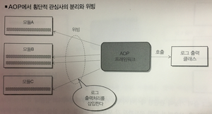

## 1-4 AOP

- AOP : Aspect Oriented Programming
- 객체 지향을 대신하는 것이 아니라 보완하는 새로운 패러다임
- 객체지향에 의존 관계 주입과 AOP 를 조합함으로써, 보다 유연하고 보존성 높은 견고한 소프트웨어 개발 가능
- 로그출력으로 예를 들면
    
- 분리한 관심사를 다시 모듈에 삽입하는 것을 '위빙(Weaving)'이라고 부름
    - 각 모듈에서는 분리된 기능을 사용하기위한 코드를 기술할 필요가 전혀 없음. 즉, 각 모듈 개발자는 횡단적 관심사에 대해 전혀 관여하지 않아도 되는 것
- 자주쓰는 용어
    - 어드바이스(Advice)
        - 실행 시 모듈에 위빙된 구체적인 처리
    - 조인포인트(Joinpoint)
        - 실행 시 처리 플로우에서 Advice 를 위빙하는 포인트 (메서드 호출, 예외발생 등)
    - 포인트컷(Pointcut)
        - 하나 또는 복수의 Joinpoint 를 묶은 것
    - 어드바이저(Advisor)
        - Advice 와 Pointcut 을 하나로 묶은 것 (스프링 AOP 에만 존재 - `관점`을 나타내는 개념)
    
    